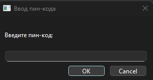
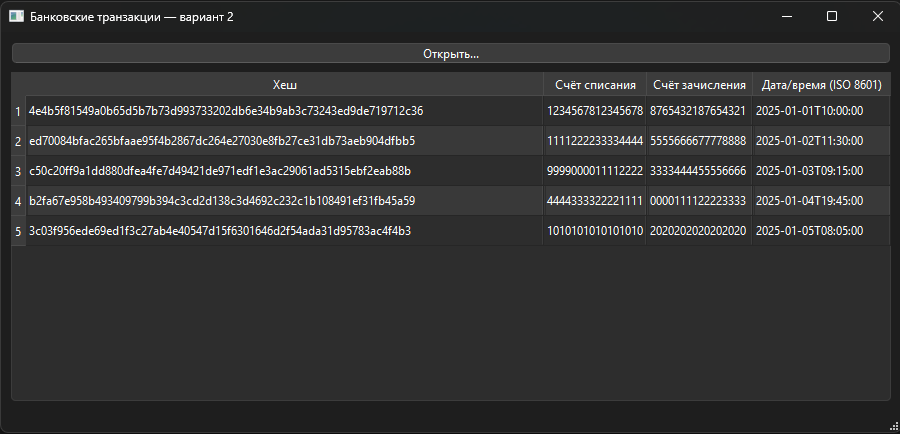

# 211_331_Neretin
Разработка и эксплуатация защищенных автоматизированных систем — Экзамен

## Описание работы программы
Программа для отображения банковских транзакций с проверкой целостности и защитой паролем.
Приложение работает с зашифрованным файлом transactions.enc, который расшифровывается с помощью AES-256-CBC при открытии. Перед доступом к данным программа требует ввод PIN-кода, который хранится в виде SHA-256 хеша. После успешного ввода пользователь выбирает зашифрованный файл, и приложение загружает из него список транзакций.

## Структура данных транзакции
- Хеш SHA-256 в кодировке Hex 
- Номер счёта списания (16 цифр) 
- Номер счёта поступления (16 цифр)
- Дата и время в формате ISO 8601

## Снимки интерфейса

